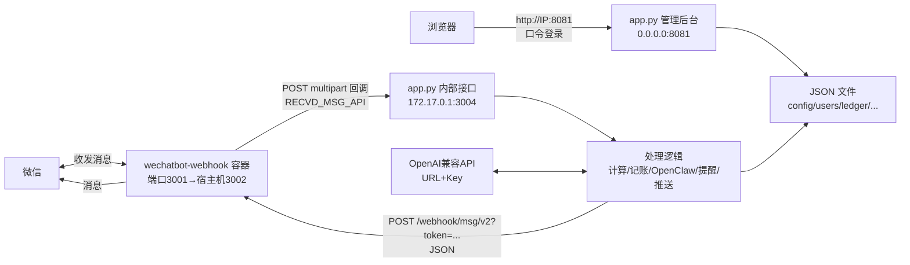

# 微信机器人「自动回复 + 管理后台」

一个部署在 Linux 服务器上的微信机器人：基于 `dannicool/docker-wechatbot-webhook` 容器收发消息，配合一个**零第三方依赖**的 Python 服务（`app.py`）完成消息处理、自动回复、定时提醒、每日推送、记账、OpenClaw AI 问答和可视化管理后台。

- 群聊：被 `@机器人` 触发；私聊：直接发消息触发
- 管理后台：浏览器访问 `http://服务器IP:8081`，口令登录后管理一切
- 自然语言：不用记命令格式，直接说“提醒我10分钟后喝水”或“每天八点推送北京天气”就能唤起对应功能；其他问题统一交给 OpenClaw

---

## 功能一览

| 分类 | 功能 | 用法 |
| --- | --- | --- |
| 自动计算 | 数学算式（`+ - × ÷` 括号 小数） | 直接发 `12*8-4` |
| AI 问答 | OpenClaw 智能体问答（按用户保留会话，可压缩/新会话，需授权） | 直接说“今天上海天气怎么样”（`/ai` 仍兼容） |
| 智能体切换 | OpenClaw ⇄ Codex 双后端，按用户持久记忆，可设全局默认 | `/智能体 codex`、`/智能体 openclaw`、`/智能体 默认`，或直接说“切换到codex” |
| 上网查询 | 需要最新信息时由 OpenClaw agent 自主调用网页搜索工具核实后再回答 | “搜一下王者最新活动”“查一下今天有什么比赛”（`/搜索`、`/上网` 仍兼容） |
| 记账 | 收入/支出，按人独立 | `/记账 +8×4 买菜`、`/记账 -15×2` |
| 记账 | 余额 / 明细 / 清空 | `/余额`、`/明细`、`/清空` |
| 定时提醒 | 到点 `@` 本人或私聊提醒 | `/提醒 10分钟后 喝水`；无参数时逐步引导 |
| 每日推送 | 每天定时推送天气（引导确认城市） | `/推送 8:00`，`/取消推送 [编号]`；无参数时逐步引导 |
| 开通 AI 权限 | 输入密码授权自己，之后才可用 AI | `/权限 <密码>` |
| 帮助 | 功能说明 | `@机器人` 或 `/说明` |
| 自然语言路由 | OpenClaw 识别提醒和每日推送 | 直接说“提醒我10分钟后喝水”“每天八点推送北京天气” |

> 未授权用户仍可使用：计算、记账、余额、明细、清空、`/提醒`、`/推送`、`/说明`。

## OpenClaw 对话与动作路由

收到非命令、非算式的消息时，会先做分层处理：

1. **零成本规则**：数学算式、斜杠命令（`/记账`、`/提醒` 等）直接处理。
2. **OpenClaw 动作路由**：只有提醒和每日推送会先让 OpenClaw 输出动作参数，再由本地服务校验并执行；缺少参数时逐步追问。
   - `提醒我10分钟后喝水` → 设置一次提醒
   - `每天八点推送北京市朝阳区天气` → 开启每日推送
3. **OpenClaw 问答（含上网查询）**：微信侧只把用户消息原样交给 OpenClaw `wxbot` 智能体，由网关执行完整的 agent 工具循环——需要最新信息时（天气、新闻、活动攻略、价格行情等）OpenClaw 会自己调用 `web_search` / `web_fetch` 工具核实，再给出最终结论；闲聊等不需要实时信息的问题直接按会话回答。微信侧不再做任何本地搜索或结果注入，旧的本地搜索兜底和旧 AI 路由不在此列。
4. **记账例外**：记账必须用精确格式，AI 不会代记：
   `/记账 +8×4`、`/记账 -15×2`

未授权用户的自然语言 AI 请求直接提示开通；已授权用户的普通问题只调用一次 OpenClaw。设置 `"smart": false` 时仍可直接对话，但不会用自然语言触发提醒或每日推送。

### OpenClaw 会话管理

每个微信用户与 OpenClaw 的对话按独立会话保存，普通 AI 回复末尾会附上下文用量（如 `（上下文 6.1k / 128k，4.8%）`）。上下文过大时可以压缩或另开新会话，旧会话不会丢失，可随时在后台查看或切回：

- `压缩上下文` / `/compact`：压缩当前会话（OpenClaw 原生压缩，命令本身不占用对话内容）
- `开启新的会话` / `/new` / `/新会话`：切换到全新上下文，旧会话保留
- 管理后台「会话与上下文」页：按用户查看历史会话与 transcript，可执行压缩、新会话、切换激活会话；所有 ID 均显示为短引用，不暴露完整微信 ID

### 智能体切换（OpenClaw / Codex）

默认使用 OpenClaw（网关 agent：联网搜索、会话压缩、上下文统计）。如果希望某些对话改由
服务器上独立部署的 **Codex CLI** 回答，可以随时切换，且按微信用户持久记忆、同一对话内无缝续聊：

- `/智能体 codex` 或直接说“切换到codex”：后续对话由 Codex 回答（新 thread 自动创建）
- `/智能体 openclaw`：切回 OpenClaw
- `/智能体 默认`：恢复全局默认；`/智能体` 查看当前智能体
- 管理后台「智能体」页：设置全局默认智能体、配置 Codex 的模型提供商（URL / Token / 模型）、
  点「测试 Codex」验证连通性

Codex 走服务器上的 `codex exec / resume`，与 OpenClaw 使用**同一套上游模型提供商**配置
（后台「智能体」页写入 `/root/.codex/config.toml`），只读沙箱运行，按微信用户维持 thread
会话，回复末尾同样附上下文用量统计（**只显示当前这一轮的实际上下文**，与 OpenClaw 口径一致，
不再累加多轮总量）。后台「智能体」页可配置「Codex 上下文窗口」，用于决定用量百分比的分母
（Codex CLI 的默认上限是 `272000`，到达后会自动压缩；如确属更大窗口的模型可改大）。
Codex 同样支持手动压缩：说「压缩上下文」/`/compact` 会把旧 Codex 线程整理成摘要并归档，
再用摘要开一个全新小线程继续（摘要模式，上下文会明显变小）；「开启新的会话」则直接归档旧线程开新会话。
若某个用户的历史 thread 被清理或迁移（`resume` 找不到会话），机器人会自动开一个全新 thread 继续对话，不中断。

### 命令模式分步引导

斜杠命令不再要求一次说全，缺什么问什么，一步步来：

- `/推送` → 问“每天几点推送天气？”→ 回 `8:30` → 问“推送哪个城市？”→ 回 `长垣` → 确认开启
- `/提醒` → 问“几点提醒？”→ 回 `10分钟后` → 问“提醒你做什么？”→ 回 `喝水` → 设置成功
- 已给部分参数则只问缺的：`/推送 8:00` 只问城市，`/提醒 10分钟后` 只问内容

---

## 一、项目部署（Linux 服务器）

> 本文只讲 Linux 服务器方案：上传文件 → 跑安装脚本 → 扫码登录 → 完事。不依赖 git clone。

### 1.1 准备

- 一台 Linux 服务器（本方案基于 CentOS 7 验证；Ubuntu/Debian 同理，包管理器换成 `apt`）
- 已安装 **Docker**（`docker -v` 可验证）和 **systemd**
- 放行安全组/防火墙端口：`3002`（扫码登录页）、`8081`（管理后台）

### 1.2 上传项目文件

在本地（你的电脑）把整个项目目录上传到服务器 `/root/wxbot-reply`：

```bash
scp -r wxbot-reply root@<服务器IP>:/root/
```

### 1.3 一键安装

```bash
ssh root@<服务器IP>
cd /root/wxbot-reply
bash deploy/install.sh
```

脚本会完成：
1. 创建数据目录 `/root/wxbot-reply`、日志目录 `/root/wxBot_logs`、会话文件 `/root/wxBot_session.json`
2. 生成机器人登录 token（`.login_token`，可手动改）与后台口令（`.view_token`，可手动改）
3. 写入 `config.json`（自动回复开关 + OpenClaw 配置，见下文）
4. 创建 systemd 服务 `wxbot-reply.service` 并启动（Python 标准库实现，**无需安装任何第三方包**）
5. 启动机器人容器 `wxBotWebhook`（镜像 `dannicool/docker-wechatbot-webhook`）

### 1.4 配置 AI（可选）

所有 AI 请求统一走本机 OpenClaw 网关（相当于常驻挂载，默认 `http://127.0.0.1:18788/v1`），
网关地址与模型路由（`openclaw:wxbot`）不需要手工配置。真正需要配置的是**上游模型提供商**
（URL / Token / 模型），在管理后台「模型提供商配置」页完成：

1. 填提供商 ID（默认 `deepseek`）、接口地址（如 `https://api.deepseek.com/v1`）和 API Token；
   Codex 智能体若启用，在同一页下方「智能体切换」填写相同提供商信息（Codex 的
   `config.toml` 会自动复用并登录）。
2. 点「获取模型」拉取该提供商可用模型列表并选择；
3. 点「保存并应用」：写入 OpenClaw 配置（`openclaw.json` 的 provider + `wxbot` 智能体模型），
   自动重启 OpenClaw 网关并等待健康后生效；「测试连接」可验证整条链路。

联网搜索由 OpenClaw 的 `web_search` 工具完成（`wxbot` 智能体已开放 `group:web`），
搜索提供商在 `openclaw.json` 的 `tools.web.search` 配置（当前为 Tavily，key 存放在
`/root/openclaw/openclaw_space/.env` 的 `TAVILY_API_KEY`）；提供商不可用时可换
Brave / Exa / Perplexity 等任一支持的引擎。

`config.json` 的 `openclaw` 段由后台自动维护，通常无需手改：

```json
{
  "openclaw": {
    "enabled": true,
    "base_url": "http://127.0.0.1:18788/v1",
    "api_key": "<OpenClaw Gateway token，自动同步>",
    "model": "openclaw:wxbot"
  }
}
```

机器人会把微信用户 ID 作为会话标识交给 OpenClaw，同一用户的后续提问可以延续上下文。
服务器为微信入口使用独立的 OpenClaw 智能体（`wxbot`），只开放消息、自动化和网页
（`web_search` / `web_fetch`）工具，拒绝命令执行、文件读写、节点控制和 UI；
提醒和每日推送是微信入口唯一的本地动作。AI 问答的联网搜索由 OpenClaw 在对话内部完成，
最终只展示结论，不输出工具调用标记。现有 `main` 智能体和其他渠道不受影响。
微信配置未启用 OpenClaw 时不会回退到旧 AI，而是返回统一不可用提示。

改动 OpenClaw 配置后，网关会自动重启生效，无需手动重启微信服务。

### 1.5 扫码登录微信

浏览器打开（把 IP 换成你的，token 换成 `/root/wxBot_logs/.login_token` 里的值）：

```
http://<服务器IP>:3002/login?token=<BOT_TOKEN>
```

用微信扫码。登录后管理后台「状态总览」会显示“已登录”。

### 1.6 验证

- 管理后台：`http://<服务器IP>:8081`，口令在 `/root/wxbot-reply/.view_token`
- 给自己发一条算式 `12*8-4`，应收到 `12*8-4 = 92`
- 群里 `@机器人` 发 `/说明`，应收到完整功能说明

### 1.7 常用运维命令

```bash
systemctl status wxbot-reply     # 服务状态
systemctl restart wxbot-reply    # 重启服务
tail -f /root/wxbot-reply/error.log          # 服务报错
tail -f /root/wxBot_logs/app.*.log           # 机器人日志
docker logs -f wxBotWebhook                  # 容器日志
docker restart wxBotWebhook                  # 重启机器人容器（掉线时）
```

### 1.8 环境变量（可选）

`app.py` 的所有路径/端口都可以用环境变量覆盖，默认值与上表一致：

| 环境变量 | 默认值 | 说明 |
| --- | --- | --- |
| `WXBOT_BASE_DIR` | `/root/wxbot-reply` | 数据目录 |
| `WXBOT_INT_BIND` / `WXBOT_INT_PORT` | `172.17.0.1` / `3004` | 容器回调内部接口 |
| `WXBOT_VIEW_BIND` / `WXBOT_VIEW_PORT` | `0.0.0.0` / `8081` | 管理后台 |
| `WXBOT_BOT_LOG_DIR` | `/root/wxBot_logs` | 机器人日志目录 |
| `WXBOT_BOT_TOKEN_FILE` | `/root/wxBot_logs/.login_token` | 机器人 API token 文件 |
| `WXBOT_BOT_BASE` | `http://127.0.0.1:3002` | 机器人发送消息接口 |
| `WXBOT_PUBLIC_BASE` | `http://127.0.0.1:3002` | 管理后台展示的扫码登录地址（填公网 IP 或域名，如 `http://47.97.219.242:3002`） |

---

## 二、镜像选择

**最终选用：`dannicool/docker-wechatbot-webhook`**

部署过程中试过多个微信机器人镜像，只有这个最终稳定跑通：

- 之前尝试的多款镜像存在扫码登录不稳、消息回调格式不符、长期挂机掉线等问题，反复试装后才确定
- 该镜像基于 Node.js 18，内置微信 hook，通过 **Webhook 方式上报收到的消息**，无需改微信客户端
- 容器内监听 `3001`，宿主机映射为 `3002`；登录页为 `http://IP:3002/login?token=...`
- 关键环境变量：
  - `LOGIN_API_TOKEN`：扫码登录页/API 的 token（与 `.login_token` 相同）
  - `RECVD_MSG_API`：收到的消息回调地址（本项目为 `http://172.17.0.1:3004/receive_msg`，`172.17.0.1` 是 Docker 网桥网关，指向宿主机上的 `app.py`）
  - `ACCEPT_RECVD_MSG_MYSELF=false`：不接收自己发的消息，防止死循环
- 挂载：
  - `/root/wxBot_logs` → `/app/log`（容器日志）
  - `/root/wxBot_session.json` → `/app/loginSession.memory-card.json`（登录会话，重启不掉线）

启动命令等价于：

```bash
touch /root/wxBot_session.json
docker run -d --name wxBotWebhook --restart unless-stopped \
  -p 3002:3001 \
  -e LOGIN_API_TOKEN="$(cat /root/wxBot_logs/.login_token)" \
  -e RECVD_MSG_API="http://172.17.0.1:3004/receive_msg" \
  -e ACCEPT_RECVD_MSG_MYSELF=false \
  -v /root/wxBot_logs:/app/log \
  -v /root/wxBot_session.json:/app/loginSession.memory-card.json \
  dannicool/docker-wechatbot-webhook
```

> 注意：`/root/wxBot_session.json` 必须先 `touch` 创建，否则 Docker 会把它当成目录挂载进去。

---

## 三、技术栈

| 层 | 技术 | 说明 |
| --- | --- | --- |
| 微信接入 | `dannicool/docker-wechatbot-webhook`（Node.js 18） | 扫码登录、收发消息、Webhook 回调上报 |
| 服务端 | Python 3（**仅标准库**：`http.server` / `urllib` / `threading` / `json`） | 消息处理、自动回复、定时任务、后台 API，零第三方依赖 |
| 进程管理 | systemd（`wxbot-reply.service`） | 守护 `app.py`，崩溃自动重启 |
| 数据存储 | JSON 文件（`/root/wxbot-reply/*.json`） | 配置、用户、权限、记账、提醒、推送，无需数据库 |
| 管理后台 | 内嵌单页 HTML/CSS/JS（原生 `fetch`） | 无框架、无构建，由 `app.py` 直接输出 |
| AI 接入 | OpenClaw 网关路由 + 上游提供商 | 后台配置提供商 URL / Token / 模型（类似 CC Switch），可拉取模型列表并在线测试 |
| AI 动作 | OpenClaw JSON 动作路由 | 仅 `set_reminder`、`set_daily_push` |
| 天气 | Open-Meteo 免费 API + 内置常用城市坐标表 | 县级市（如长垣）也能精确匹配 |
| 部署 | Docker + systemd + shell 脚本 | `deploy/install.sh` 一键安装 |
| 智能体问答 | OpenClaw Gateway `/v1/chat/completions` | 本机调用，按微信用户维持会话 |
| 智能体切换 | OpenClaw ⇄ Codex CLI（`codex exec/resume`） | 按用户持久记忆，后台可配 Codex 提供商并测试 |

---

## 四、前后端联调说明

### 4.1 整体数据流



### 4.2 入站消息（机器人 → 服务）

机器人容器把收到的每条消息以 **multipart/form-data POST** 到 `RECVD_MSG_API`（`http://172.17.0.1:3004/receive_msg`，`172.17.0.1` 是 Docker 网桥网关 = 宿主机）：

| 字段 | 说明 |
| --- | --- |
| `type` | 消息类型，文本为 `text` |
| `content` | 消息内容 |
| `source` | JSON 字符串，含 `room`（群）、`from.payload.id/name`（发送者）、`to.payload.name`（机器人昵称） |
| `isMentioned` | 是否被 `@`（群聊触发依据） |
| `isMsgFromSelf` | 是否自己发的（过滤） |
| `isSystemEvent` | 是否系统事件 |

`app.py` 仅将内部接口监听在 `172.17.0.1`，**公网无法直接访问**，只有容器能回调。

### 4.3 出站消息（服务 → 机器人）

回复/推送时，`app.py` 调用机器人的发送接口：

```
POST http://127.0.0.1:3002/webhook/msg/v2?token=<BOT_TOKEN>
Content-Type: application/json

{
  "to": "<群名> 或 {\"id\": \"<用户ID>\"}",
  "isRoom": true/false,
  "data": {"content": "回复内容"}
}
```

- 群聊：`to` 传群名，`isRoom=true`（提醒/推送会 `@` 目标用户）
- 私聊：`to` 传 `{"id": 用户ID}`，失败时自动按昵称重试
- 接口返回 `200` 不代表发送成功，需看响应体 `success` 字段

### 4.4 管理后台（浏览器 → 服务）

后台是 `app.py` 直接输出的单页应用（内嵌 HTML/CSS/JS），浏览器只通过 JSON API 交互：

| API | 方法 | 说明 |
| --- | --- | --- |
| `/login` `/logout` | POST | 口令登录（`/root/wxbot-reply/.view_token`），写入 session cookie |
| `/api/status` | GET | 机器人登录状态、自动回复开关、今日/总消息数、最近报错 |
| `/api/overview` | GET | **用户总览**：每个用户的授权状态、每日推送、提醒、记账、AI 使用（ID 一律显示短引用） |
| `/api/messages` | GET | 消息记录（关键字/发送者/群筛选 + 分页） |
| `/api/logs` | GET | 机器人日志 / 服务报错 / 系统事件 |
| `/api/config` | GET/POST | 自动回复开关 |
| `/api/openclaw/config` | GET/POST | 模型提供商配置（URL / Token / 模型），Token 脱敏展示，保存后写入 OpenClaw 并重启网关 |
| `/api/openclaw/models` | GET/POST | 拉取提供商模型列表（GET 用已保存配置，POST 可预览指定 URL/Token） |
| `/api/openclaw/test` | POST | 在线测试 OpenClaw 链路连通性 |
| `/api/openclaw/sessions` | GET | 会话与上下文列表（用户/会话短引用、上下文用量、压缩次数） |
| `/api/openclaw/sessions/<ref>` | GET | 单个会话的 transcript 与压缩记录（不含完整 ID、Gateway key 和路径） |
| `/api/openclaw/sessions` | POST | 按短引用对会话执行 `compact` / `new` / `activate` |
| `/api/reminders` `/api/reminders/cancel` | GET/POST | 定时提醒查询/取消 |
| `/api/subs` | GET/POST | 每日推送订阅管理 |
| `/api/permissions` `/api/users` | GET/POST | 授权管理、用户列表 |
| `/api/send` | POST | 管理后台手动发测试消息 |
| `/api/export` | GET | 下载完整消息记录 |

### 4.5 定时任务

`app.py` 内建两个后台线程，与 HTTP 服务并行：

- **提醒线程**：每 20 秒扫描 `reminders.json`，到点的提醒——群里 `@` 本人、私聊直接发
- **推送线程**：每天整点检查 `subscriptions.json`，按订阅时间推送天气（群订阅推群、私聊订阅推私聊）

---

## 目录结构

```
wxbot-reply/
├── app.py                    # 主服务（消息处理 + 后台，零第三方依赖）
├── README.md
├── deploy/
│   ├── install.sh            # Linux 一键安装脚本
│   ├── wxbot-reply.service   # systemd 服务单元
│   ├── docker-compose.yml    # 机器人容器 compose（替代 docker run）
│   └── config.example.json   # 配置模板
├── config.json               # 自动回复开关 + OpenClaw 网关配置（运行时生成，不入库）
├── .view_token               # 后台登录口令（运行时生成，不入库）
├── users.json                # 见过的用户（运行时生成）
├── permissions.json          # 授权列表（运行时生成）
├── ledger.json               # 记账（运行时生成）
├── reminders.json            # 定时提醒（运行时生成）
├── subscriptions.json        # 每日推送（运行时生成）
├── messages.log              # 消息记录 JSONL（运行时生成）
├── error.log                 # 服务报错（运行时生成）
└── system_events.log         # 系统事件（运行时生成）

```

## 安全说明

- 管理后台有口令保护（`/root/wxbot-reply/.view_token`），会话 12 小时过期
- 内部接口只监听 `172.17.0.1`，公网不可达
- `config.json` 里的 AI Key、`.login_token`、`.view_token` 均已在 `.gitignore` 中排除，**请勿提交到公开仓库**
