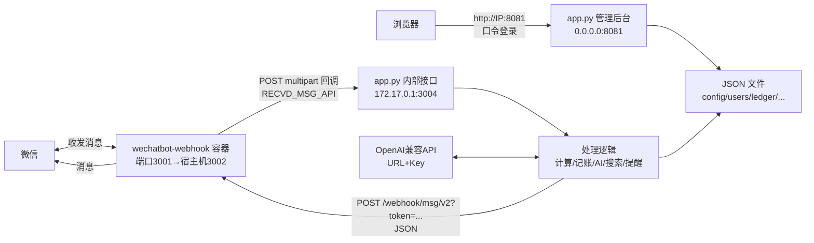

# 微信机器人「自动回复 + 管理后台」

一个部署在 Linux 服务器上的微信机器人：基于 `dannicool/docker-wechatbot-webhook` 容器收发消息，配合一个**零第三方依赖**的 Python 服务（`app.py`）完成消息处理、自动回复、定时提醒、每日推送、记账、AI 问答（含联网搜索）和可视化管理后台。

- 群聊：被 `@机器人` 触发；私聊：直接发消息触发
- 管理后台：浏览器访问 `http://服务器IP:8081`，口令登录后管理一切
- 自然语言：不用记命令格式，直接说“提醒我10分钟后喝水”“上海天气”“今天有什么比赛”就能唤起对应功能（记账除外，见下文）

---

## 功能一览

| 分类 | 功能 | 用法 |
| --- | --- | --- |
| 自动计算 | 数学算式（`+ - × ÷` 括号 小数） | 直接发 `12*8-4` |
| AI 问答 | OpenClaw 智能体问答（按用户保留会话，需授权） | 直接说“今天上海天气怎么样”（`/ai` 仍兼容） |
| 联网搜索 | 实时网页搜索（赛程/新闻等） | 直接说“今天有什么比赛”（`/搜索` 仍兼容） |
| 记账 | 收入/支出，按人独立 | `/记账 +8×4 买菜`、`/记账 -15×2` |
| 记账 | 余额 / 明细 / 清空 | `/余额`、`/明细`、`/清空` |
| 定时提醒 | 到点 `@` 本人或私聊提醒 | `/提醒 10分钟后 喝水`；无参数时逐步引导 |
| 每日推送 | 每天定时推送天气（引导确认城市） | `/推送 8:00`，`/取消推送 [编号]`；无参数时逐步引导 |
| 开通 AI 权限 | 输入密码授权自己，之后才可用 AI | `/权限 <密码>` |
| 帮助 | 功能说明 | `@机器人` 或 `/说明` |
| 自然语言路由 | 识别意图并唤起提醒/天气/搜索/推送 | 直接说“提醒我10分钟后喝水”“上海天气” |

> 未授权用户仍可使用：计算、记账、余额、明细、清空、提醒、推送、搜索、`/说明`。

## 智能意图识别（v2：工具路由）

收到非命令、非算式的消息时，会先做分层处理：

1. **零成本规则**：数学算式（`12*8-4`）、斜杠命令（`/记账`、`/提醒` 等）直接处理，不走 AI
2. **AI 工具路由（function calling）**：规则兜不住的自然语言，把**每个功能一份工具 schema**（触发条件 + 参数格式）一起交给 AI，由 function calling 判断命中哪个工具、并生成参数
   - `提醒我10分钟后喝水` → `set_reminder(time=10分钟后, content=喝水)`
   - `上海天气` → `get_weather(city=上海)`
   - `每天八点推送北京市朝阳区天气` → `set_daily_push(time=8:00, city=北京)`（城市自动归一化）
   - `今天有什么足球比赛` → `web_search(query=…)`
   - 闲聊 → AI 直接在 content 里回复（**单次调用**，不二次生成），仅已授权用户可聊，未授权提示开通
3. **缺参数自动追问**：AI 生成参数后代码校验，缺什么问什么，最多追问 2 轮补齐后**必定执行**，不会出现“识别到了却没生效”
   - “上海天气”缺城市 → 追问“查哪个城市的天气？”→ 回“北京”→ 出结果
   - “提醒我10分钟后”（缺内容）→ 追问“提醒你做什么？”→ 回“关灯”→ 设置成功
4. **记账例外**：AI 识别为记账时**只回格式引导，绝不写入账本**，避免记错。记账必须用精确格式：
   `/记账 +8×4`、`/记账 -15×2`

**响应速度**：闲聊只调一次 AI；未授权用户的纯闲聊（不含任何功能词）直接提示开通，完全不调 AI。

AI 只负责“听懂”，不负责“执行”：识别结果由代码路由到确定的工具函数，执行仍然可靠。
可在 `config.json` 中设置 `"smart": false` 关闭自然语言识别，回到纯命令模式。

### 命令模式分步引导

斜杠命令不再要求一次说全，缺什么问什么，一步步来：

- `/推送` → 问“每天几点推送天气？”→ 回 `8:30` → 问“推送哪个城市？”→ 回 `长垣` → 确认开启
- `/提醒` → 问“几点提醒？”→ 回 `10分钟后` → 问“提醒你做什么？”→ 回 `喝水` → 设置成功
- 已给部分参数则只问缺的：`/推送 8:00` 只问城市，`/提醒 10分钟后` 只问内容

---

## 一、项目部署（Linux 服务器）

> 本文只讲 Linux 服务器方案：上传文件 → 跑安装脚本 → 扫码登录 → 完事。不依赖 git clone。

### 1.1 准备

- 一台 Linux 服务器（本方案基于 CentOS 7 验证；Ubuntu/Debian 同理，包管理器换成 `apt`）
- 已安装 **Docker**（`docker -v` 可验证）和 **systemd**
- 放行安全组/防火墙端口：`3002`（扫码登录页）、`8081`（管理后台）

### 1.2 上传项目文件

在本地（你的电脑）把整个项目目录上传到服务器 `/root/wxbot-reply`：

```bash
scp -r wxbot-reply root@<服务器IP>:/root/
```

### 1.3 一键安装

```bash
ssh root@<服务器IP>
cd /root/wxbot-reply
bash deploy/install.sh
```

脚本会完成：
1. 创建数据目录 `/root/wxbot-reply`、日志目录 `/root/wxBot_logs`、会话文件 `/root/wxBot_session.json`
2. 生成机器人登录 token（`.login_token`，可手动改）与后台口令（`.view_token`，可手动改）
3. 写入 `config.json`（自动回复开关 + AI 配置，见下文）
4. 创建 systemd 服务 `wxbot-reply.service` 并启动（Python 标准库实现，**无需安装任何第三方包**）
5. 启动机器人容器 `wxBotWebhook`（镜像 `dannicool/docker-wechatbot-webhook`）

### 1.4 配置 AI（可选）

编辑 `/root/wxbot-reply/config.json`：

```json
{
  "auto_reply": true,
  "ai": {
    "base_url": "https://你的OpenAI兼容接口/v1",
    "api_key": "sk-xxxx",
    "model": "gpt-5.5"
  }
}
```

也可以在管理后台「AI 配置」页填写（支持在线测试模型连通性）。这份配置用于意图路由和联网搜索整理；搜索、天气、计算、记账、提醒等确定性功能不需要 AI。

在已经部署 OpenClaw Gateway 的服务器上，AI 问答可以通过 OpenClaw，配置写在 `config.json` 的 `openclaw` 段：

```json
{
  "openclaw": {
    "enabled": true,
    "base_url": "http://127.0.0.1:18788/v1",
    "api_key": "<OpenClaw Gateway token>",
    "model": "openclaw:wxbot"
  }
}
```

机器人会把微信用户 ID 作为会话标识交给 OpenClaw，同一用户的后续提问可以延续上下文。服务器为微信入口使用独立的 `wxbot` 智能体，只开放网页搜索/抓取，不开放命令执行、文件读写、消息发送或自动化工具；现有 `main` 智能体和其他渠道不受影响。全新安装时 `openclaw.enabled` 默认为 `false`，未配置或显式关闭时自动回退到上面的 OpenAI 兼容接口。OpenClaw 的模型 provider 使用同一个 `ai.base_url`、`ai.api_key` 和 `ai.model`，在已部署 OpenClaw 的服务器上手工填入 Gateway token 即可启用，不把真实 token 提交到仓库。

改完配置后重启服务：

```bash
systemctl restart wxbot-reply
```

### 1.5 扫码登录微信

浏览器打开（把 IP 换成你的，token 换成 `/root/wxBot_logs/.login_token` 里的值）：

```
http://<服务器IP>:3002/login?token=<BOT_TOKEN>
```

用微信扫码。登录后管理后台「状态总览」会显示“已登录”。

### 1.6 验证

- 管理后台：`http://<服务器IP>:8081`，口令在 `/root/wxbot-reply/.view_token`
- 给自己发一条算式 `12*8-4`，应收到 `12*8-4 = 92`
- 群里 `@机器人` 发 `/说明`，应收到完整功能说明

### 1.7 常用运维命令

```bash
systemctl status wxbot-reply     # 服务状态
systemctl restart wxbot-reply    # 重启服务
tail -f /root/wxbot-reply/error.log          # 服务报错
tail -f /root/wxBot_logs/app.*.log           # 机器人日志
docker logs -f wxBotWebhook                  # 容器日志
docker restart wxBotWebhook                  # 重启机器人容器（掉线时）
```

### 1.8 环境变量（可选）

`app.py` 的所有路径/端口都可以用环境变量覆盖，默认值与上表一致：

| 环境变量 | 默认值 | 说明 |
| --- | --- | --- |
| `WXBOT_BASE_DIR` | `/root/wxbot-reply` | 数据目录 |
| `WXBOT_INT_BIND` / `WXBOT_INT_PORT` | `172.17.0.1` / `3004` | 容器回调内部接口 |
| `WXBOT_VIEW_BIND` / `WXBOT_VIEW_PORT` | `0.0.0.0` / `8081` | 管理后台 |
| `WXBOT_BOT_LOG_DIR` | `/root/wxBot_logs` | 机器人日志目录 |
| `WXBOT_BOT_TOKEN_FILE` | `/root/wxBot_logs/.login_token` | 机器人 API token 文件 |
| `WXBOT_BOT_BASE` | `http://127.0.0.1:3002` | 机器人发送消息接口 |
| `WXBOT_PUBLIC_BASE` | `http://127.0.0.1:3002` | 管理后台展示的扫码登录地址（填公网 IP 或域名，如 `http://47.97.219.242:3002`） |

---

## 二、镜像选择

**最终选用：`dannicool/docker-wechatbot-webhook`**

部署过程中试过多个微信机器人镜像，只有这个最终稳定跑通：

- 之前尝试的多款镜像存在扫码登录不稳、消息回调格式不符、长期挂机掉线等问题，反复试装后才确定
- 该镜像基于 Node.js 18，内置微信 hook，通过 **Webhook 方式上报收到的消息**，无需改微信客户端
- 容器内监听 `3001`，宿主机映射为 `3002`；登录页为 `http://IP:3002/login?token=...`
- 关键环境变量：
  - `LOGIN_API_TOKEN`：扫码登录页/API 的 token（与 `.login_token` 相同）
  - `RECVD_MSG_API`：收到的消息回调地址（本项目为 `http://172.17.0.1:3004/receive_msg`，`172.17.0.1` 是 Docker 网桥网关，指向宿主机上的 `app.py`）
  - `ACCEPT_RECVD_MSG_MYSELF=false`：不接收自己发的消息，防止死循环
- 挂载：
  - `/root/wxBot_logs` → `/app/log`（容器日志）
  - `/root/wxBot_session.json` → `/app/loginSession.memory-card.json`（登录会话，重启不掉线）

启动命令等价于：

```bash
touch /root/wxBot_session.json
docker run -d --name wxBotWebhook --restart unless-stopped \
  -p 3002:3001 \
  -e LOGIN_API_TOKEN="$(cat /root/wxBot_logs/.login_token)" \
  -e RECVD_MSG_API="http://172.17.0.1:3004/receive_msg" \
  -e ACCEPT_RECVD_MSG_MYSELF=false \
  -v /root/wxBot_logs:/app/log \
  -v /root/wxBot_session.json:/app/loginSession.memory-card.json \
  dannicool/docker-wechatbot-webhook
```

> 注意：`/root/wxBot_session.json` 必须先 `touch` 创建，否则 Docker 会把它当成目录挂载进去。

---

## 三、技术栈

| 层 | 技术 | 说明 |
| --- | --- | --- |
| 微信接入 | `dannicool/docker-wechatbot-webhook`（Node.js 18） | 扫码登录、收发消息、Webhook 回调上报 |
| 服务端 | Python 3（**仅标准库**：`http.server` / `urllib` / `threading` / `json`） | 消息处理、自动回复、定时任务、后台 API，零第三方依赖 |
| 进程管理 | systemd（`wxbot-reply.service`） | 守护 `app.py`，崩溃自动重启 |
| 数据存储 | JSON 文件（`/root/wxbot-reply/*.json`） | 配置、用户、权限、记账、提醒、推送，无需数据库 |
| 管理后台 | 内嵌单页 HTML/CSS/JS（原生 `fetch`） | 无框架、无构建，由 `app.py` 直接输出 |
| AI 接入 | OpenAI 兼容 Chat Completions API | 支持任意兼容接口（URL + Key + 模型），后台可在线测试 |
| AI 工具 | Function Calling + 内置工具 | `web_search`（Bing 爬取，无需 key）、`get_weather`（Open-Meteo）、`get_current_datetime`、`calculate` |
| 搜索 | Bing（`cn.bing.com/search`）HTML 解析 | 无需搜索引擎 API key，国内可访问 |
| 天气 | Open-Meteo 免费 API + 内置常用城市坐标表 | 县级市（如长垣）也能精确匹配 |
| 部署 | Docker + systemd + shell 脚本 | `deploy/install.sh` 一键安装 |
| 智能体问答 | OpenClaw Gateway `/v1/chat/completions` | 本机调用，按微信用户维持会话 |

---

## 四、前后端联调说明

### 4.1 整体数据流



### 4.2 入站消息（机器人 → 服务）

机器人容器把收到的每条消息以 **multipart/form-data POST** 到 `RECVD_MSG_API`（`http://172.17.0.1:3004/receive_msg`，`172.17.0.1` 是 Docker 网桥网关 = 宿主机）：

| 字段 | 说明 |
| --- | --- |
| `type` | 消息类型，文本为 `text` |
| `content` | 消息内容 |
| `source` | JSON 字符串，含 `room`（群）、`from.payload.id/name`（发送者）、`to.payload.name`（机器人昵称） |
| `isMentioned` | 是否被 `@`（群聊触发依据） |
| `isMsgFromSelf` | 是否自己发的（过滤） |
| `isSystemEvent` | 是否系统事件 |

`app.py` 仅将内部接口监听在 `172.17.0.1`，**公网无法直接访问**，只有容器能回调。

### 4.3 出站消息（服务 → 机器人）

回复/推送时，`app.py` 调用机器人的发送接口：

```
POST http://127.0.0.1:3002/webhook/msg/v2?token=<BOT_TOKEN>
Content-Type: application/json

{
  "to": "<群名> 或 {\"id\": \"<用户ID>\"}",
  "isRoom": true/false,
  "data": {"content": "回复内容"}
}
```

- 群聊：`to` 传群名，`isRoom=true`（提醒/推送会 `@` 目标用户）
- 私聊：`to` 传 `{"id": 用户ID}`，失败时自动按昵称重试
- 接口返回 `200` 不代表发送成功，需看响应体 `success` 字段

### 4.4 管理后台（浏览器 → 服务）

后台是 `app.py` 直接输出的单页应用（内嵌 HTML/CSS/JS），浏览器只通过 JSON API 交互：

| API | 方法 | 说明 |
| --- | --- | --- |
| `/login` `/logout` | POST | 口令登录（`/root/wxbot-reply/.view_token`），写入 session cookie |
| `/api/status` | GET | 机器人登录状态、自动回复开关、今日/总消息数、最近报错 |
| `/api/overview` | GET | **用户总览**：每个用户的授权状态、每日推送、提醒、记账、AI 使用（长 ID 默认隐藏，可点“显示完整ID”） |
| `/api/messages` | GET | 消息记录（关键字/发送者/群筛选 + 分页） |
| `/api/logs` | GET | 机器人日志 / 服务报错 / 系统事件 |
| `/api/config` | GET/POST | 自动回复开关 |
| `/api/ai` | GET/POST | AI 配置（URL / Key / 模型），Key 脱敏展示 |
| `/api/ai/models` `/api/ai/test` | GET/POST | 拉取模型列表、在线测试 AI 连通性 |
| `/api/reminders` `/api/reminders/cancel` | GET/POST | 定时提醒查询/取消 |
| `/api/subs` | GET/POST | 每日推送订阅管理 |
| `/api/permissions` `/api/users` | GET/POST | 授权管理、用户列表 |
| `/api/send` | POST | 管理后台手动发测试消息 |
| `/api/export` | GET | 下载完整消息记录 |

### 4.5 定时任务

`app.py` 内建两个后台线程，与 HTTP 服务并行：

- **提醒线程**：每 20 秒扫描 `reminders.json`，到点的提醒——群里 `@` 本人、私聊直接发
- **推送线程**：每天整点检查 `subscriptions.json`，按订阅时间推送天气（群订阅推群、私聊订阅推私聊）

---

## 目录结构

```
wxbot-reply/
├── app.py                    # 主服务（消息处理 + 后台，零第三方依赖）
├── README.md
├── deploy/
│   ├── install.sh            # Linux 一键安装脚本
│   ├── wxbot-reply.service   # systemd 服务单元
│   ├── docker-compose.yml    # 机器人容器 compose（替代 docker run）
│   └── config.example.json   # 配置模板
├── config.json               # 自动回复开关 + AI 配置（运行时生成，不入库）
├── .view_token               # 后台登录口令（运行时生成，不入库）
├── users.json                # 见过的用户（运行时生成）
├── permissions.json          # 授权列表（运行时生成）
├── ledger.json               # 记账（运行时生成）
├── reminders.json            # 定时提醒（运行时生成）
├── subscriptions.json        # 每日推送（运行时生成）
├── messages.log              # 消息记录 JSONL（运行时生成）
├── error.log                 # 服务报错（运行时生成）
└── system_events.log         # 系统事件（运行时生成）

```

## 安全说明

- 管理后台有口令保护（`/root/wxbot-reply/.view_token`），会话 12 小时过期
- 内部接口只监听 `172.17.0.1`，公网不可达
- `config.json` 里的 AI Key、`.login_token`、`.view_token` 均已在 `.gitignore` 中排除，**请勿提交到公开仓库**
